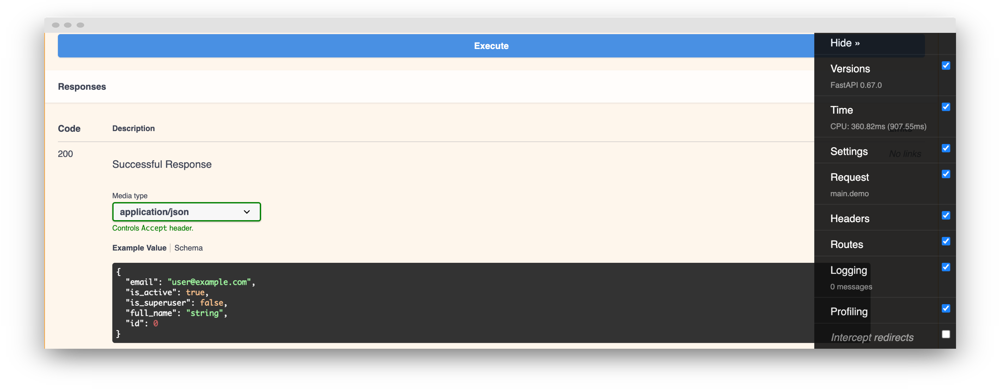

A debug toolbar for FastAPI based on the original [django-debug-toolbar](https://github.com/jazzband/django-debug-toolbar).

**Swagger UI** & **GraphQL** are supported.

## Installation

```sh
pip install fastapi-debug-toolbar
```

!!! info

    The following packages are automatically installed:

    * [Jinja2](https://github.com/pallets/jinja) for toolbar templates.
    * [aiofiles](https://github.com/Tinche/aiofiles) to serve toolbar static files.
    * [pyinstrument](https://github.com/joerick/pyinstrument) for profiling support.

## Quickstart

Add `DebugToolbarMiddleware` middleware to your FastAPI application:

```py
{!src/quickstart.py!}
```

## How it works

{ class=dt-tab }

Once installed, the **debug toolbar tab** is displayed on the right side of any html page, just **click on it** to open the navbar.

The debug toolbar can be used with [Swagger UI](https://swagger.io/tools/swagger-ui/) or [GraphiQL](https://github.com/graphql/graphiql) and it is automatically updated after any request using a cookie-based system.


