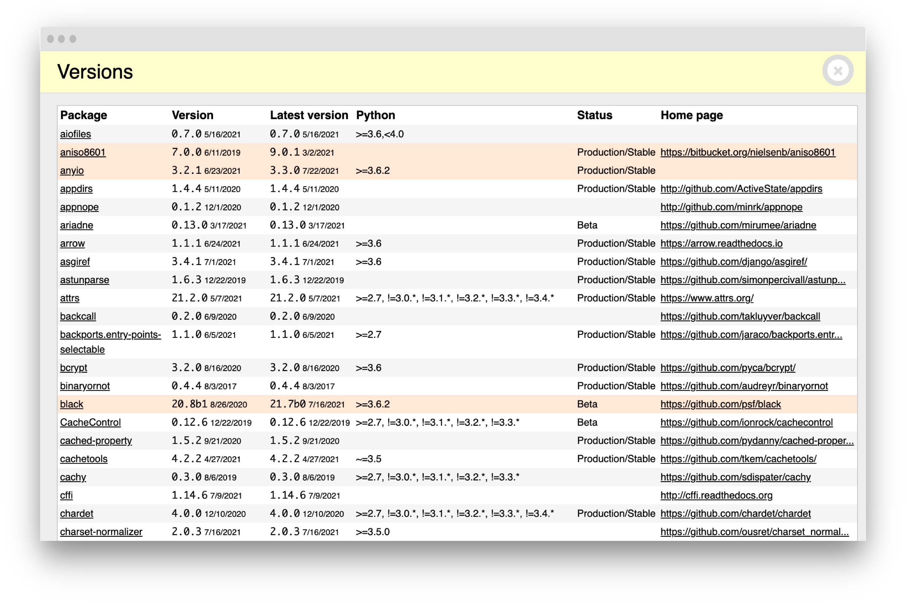
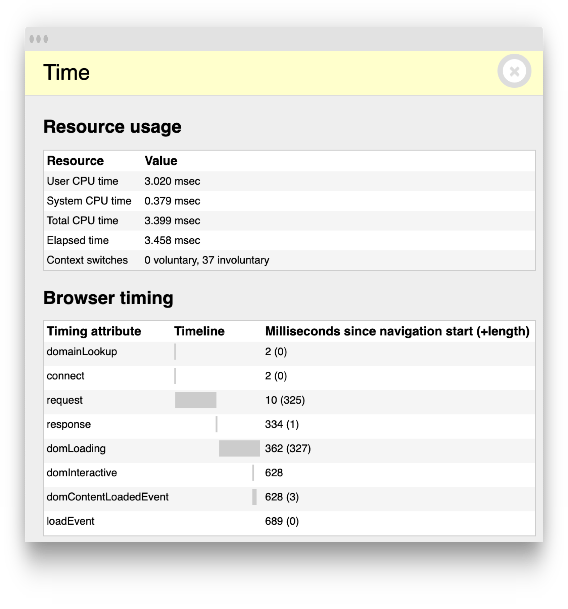
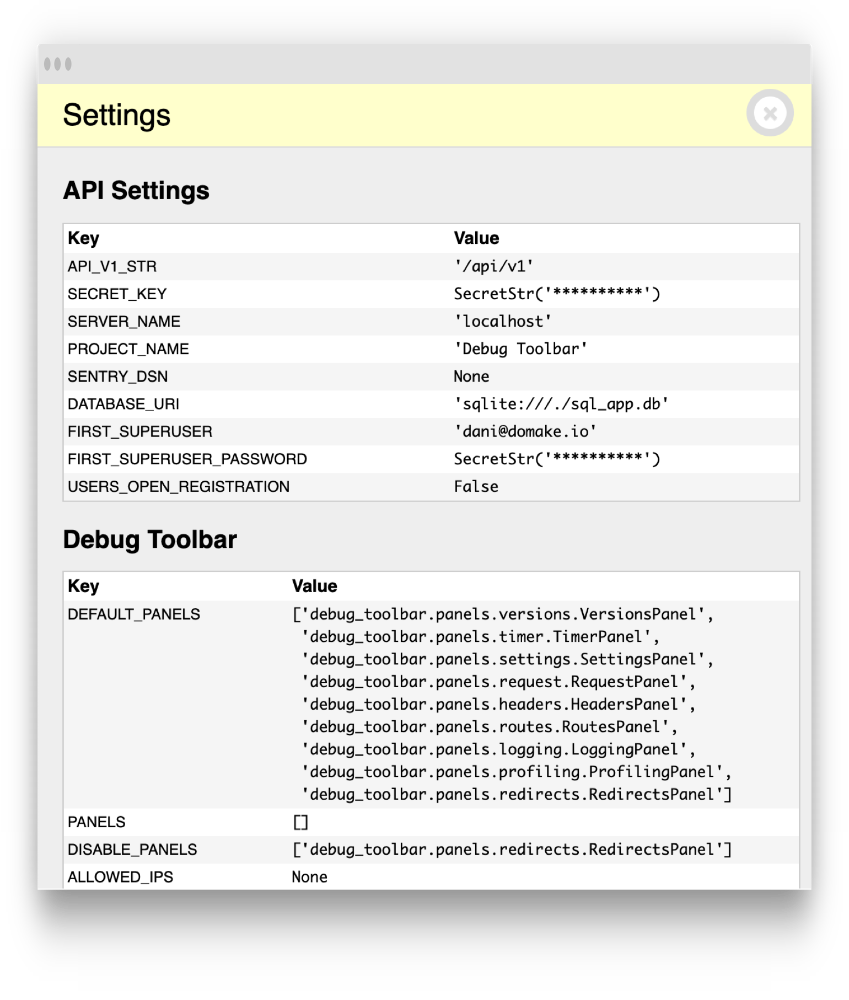
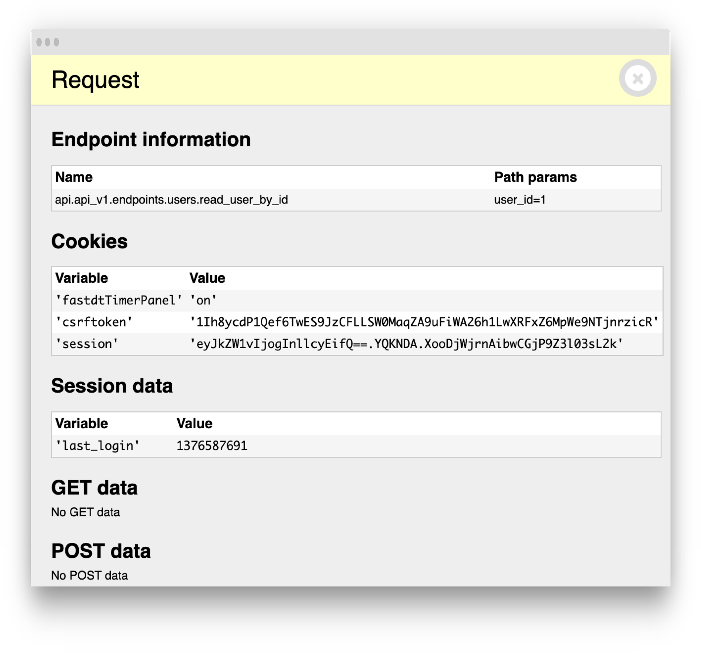
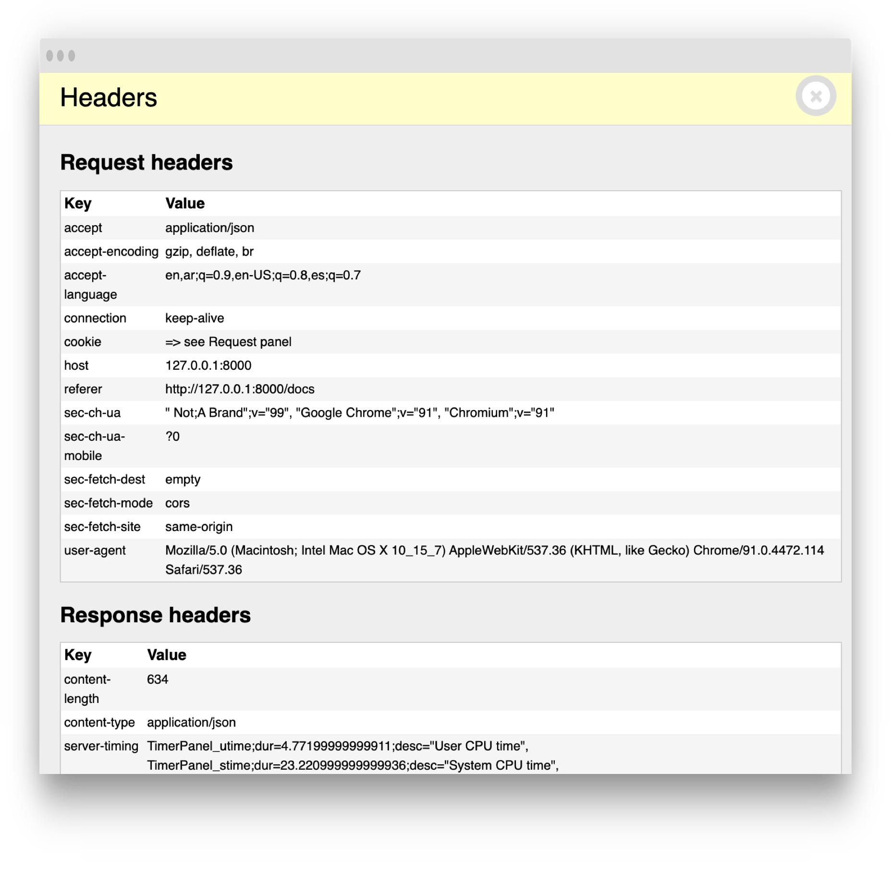
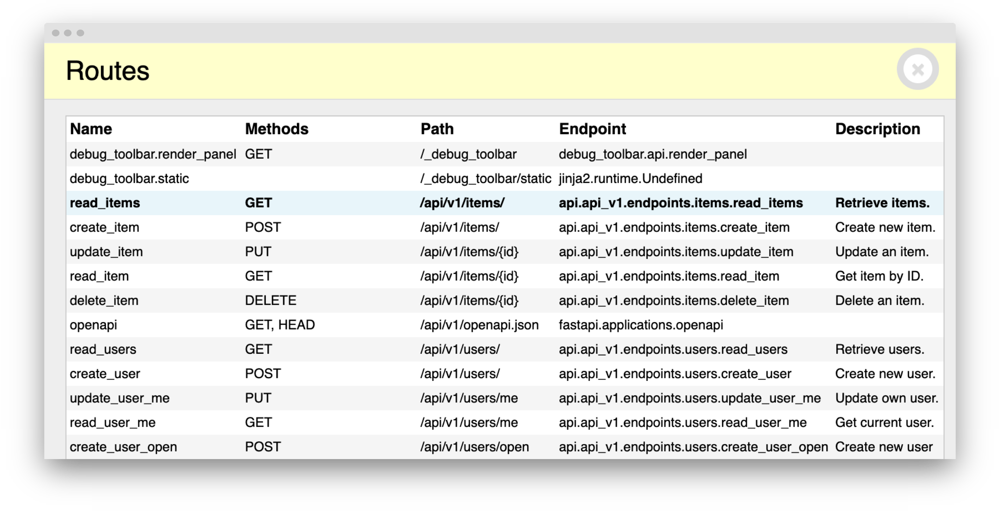
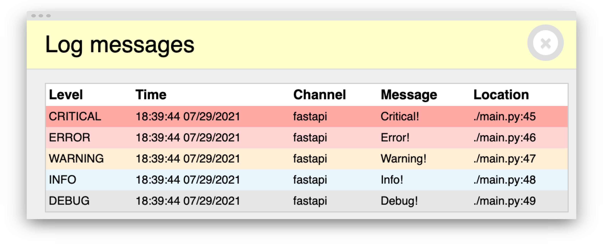
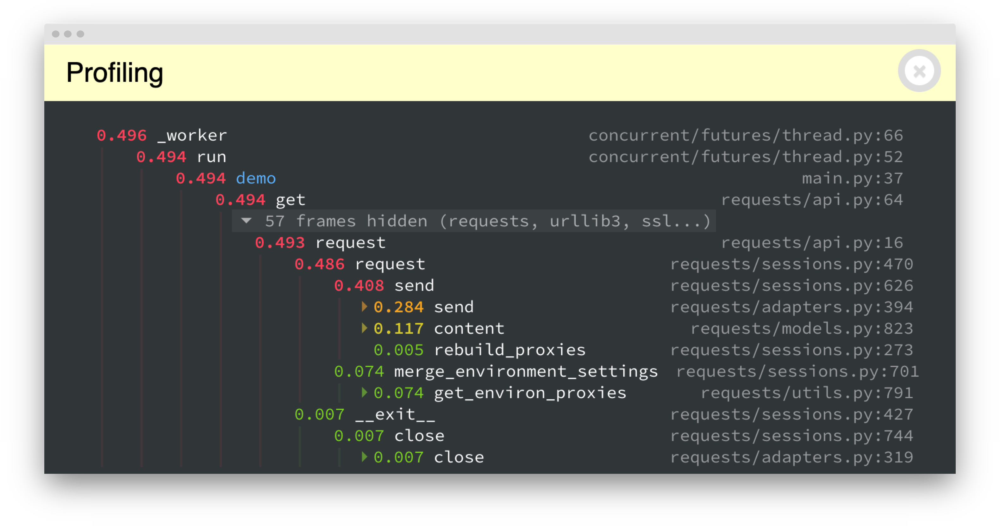

Here's a list of built-in panels available:

## VersionsPanel

{ class=panel }

## TimerPanel

{ class=panel }

## SettingsPanel

{ class=panel }

## RequestPanel

{ class=panel }

## HeadersPanel

{ class=panel }

## RoutesPanel

{ class=panel }

## LoggingPanel

{ class=panel }

## ProfilingPanel

{ class=panel }
