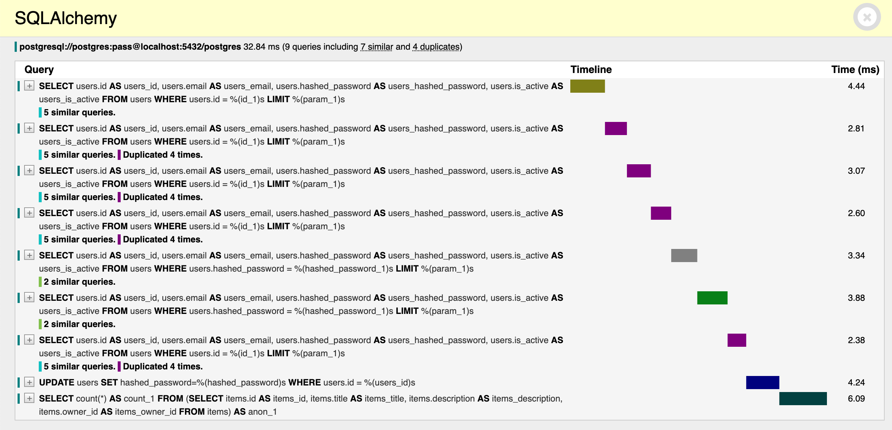

## SQLAlchemy

Please make sure to use the *"Dependency Injection"* system as described in the [FastAPI docs](https://fastapi.tiangolo.com/tutorial/sql-databases/#create-a-dependency) and add the SQLAlchemy panel to the argument list of the Debug Toolbar middleware:


```py hl_lines="8"
{!src/sql/sqlalchemy.py!}
```


